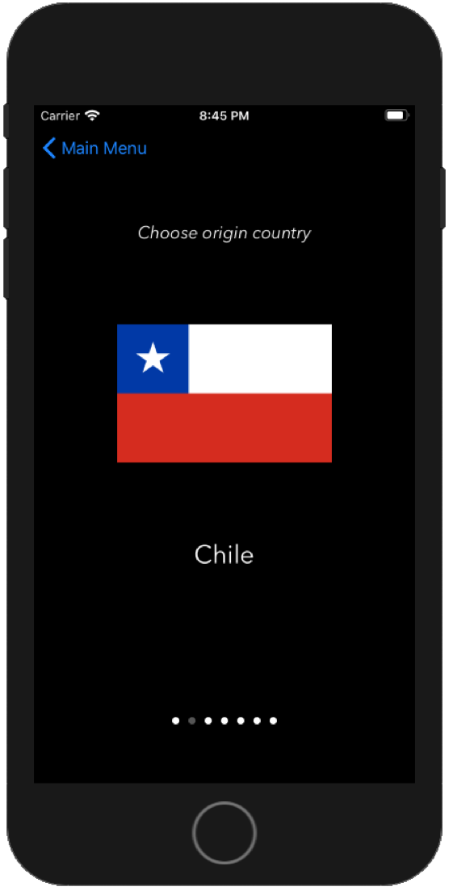

# &yen;&euro;$\*  - *Currency Converter*
##### \*Originally named *Json3*
#### A simple, yet stylish currency converter. 
Taylor made, API requests to central banks around the world.
Coded using just [Swift](https://github.com/apple/swift) for **IOS**.
Just for fun!

***Note:*** *due to the use of CocoaPods in the project, for now, if you wanna run the project, you should run it using the [Json 3.xcworkspace](https://github.com/seb-salazar/YES-iOS/tree/master/Json%203.xcworkspace) file, and **not** the [Json 3.xcodeproj](https://github.com/seb-salazar/YES-iOS/tree/master/Json%203.xcodeproj) file, otherwise, it will not run*.

**Table of Views**
* [Main Menu](#1)
* [Local Values](#2)
* [Travel Mode - Origin Country](#3)
* [Travel Mode - Destination Country](#4)
* [Travel Mode - Currency Converter](#5)

## Main Menu
<a name="1">

    

</a>

## Local Values
<a name="2">

    

</a>

## Travel Mode - Origin Country
<a name="3">

    

</a>

## Travel Mode - Destination Country
<a name="4">

    

</a>

## Travel Mode - Currency Converter
<a name="5">

 
    
    

</a>