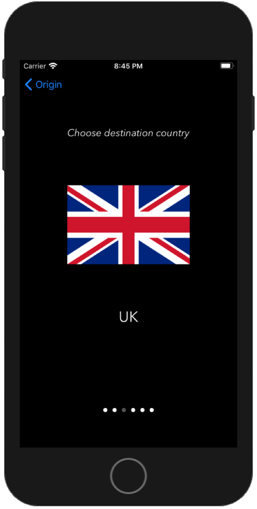
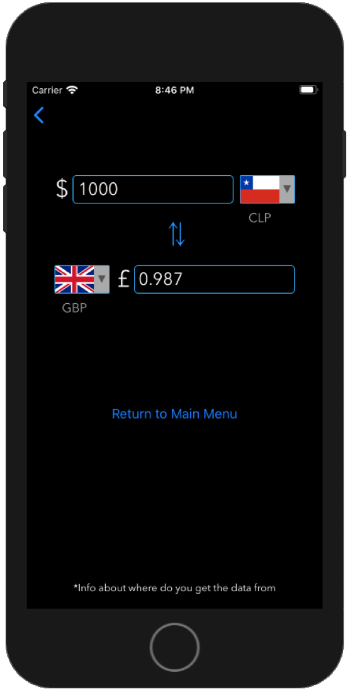

#&yen;&euro;$\*  - *Currency Converter*
#####\*Originally named *Json3*
####A simple, yet stylish currency converter. 
Taylor made, API requests to central banks around the world.
Coded using just [Swift](https://github.com/apple/swift) for **IOS**.
Just for fun!

***Note:*** *due to the use of CocoaPods in the project, for now, if you wanna run the project, you should run it using the **Json 3.xcworkspace** file, and **not** the **Json 3.xcodeproj** file, otherwise, it will not run*.

**Table of Views**
* [Main Menu](#1)
* [Local Values](#2)
* [Travel Mode - Origin Country](#3)
* [Travel Mode - Destination Country](#4)
* [Travel Mode - Currency Converter](#5)

<a name="1">
### Main Menu

</a>

<a name="2">
### Local Values

</a>

<a name="3">
### Travel Mode - Origin Country

</a>

<a name="4">
### Travel Mode - Destination Country

</a>

<a name="5">
### Travel Mode - Currency Converter

</a>